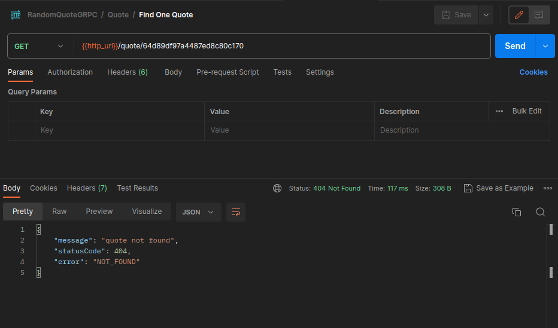

# Random Quote Generator using gRPC (TypeScript, Nestjs)

This application consists of three distinct services, all built upon the efficient gRPC protocol: User, Auth, and Quote. These services seamlessly interact with both one another and clients through the advanced gRPC protocol. The administrative role, held by editors, empowers them to oversee user management and quote administration. Meanwhile, users enjoy the ability to access random quotes, adding an element of serendipity to their experience.

**User Service**

The User Service provides functionality related to managing user(quote editor) information.
Methods:

- findOneById
- findOneByUsername
- createUser
- removeUser

**Auth Service**

The Auth Service handles user authentication and authorization.
Methods:

- login
- verifyToken

**Quote Service**

The Quote Service retrieves and manages quotes.

- findOneQuoteById
- randDomQuote
- createQuote
- removeQuoteById
- updateQuote

**Proto Files**

for more info about methods and input/output types check out proto directory

**API Gateway**

The API Gateway serves as an entry point for clients to communicate with the gRPC services. It translates HTTP requests to gRPC requests and vice versa.

- Port: 3000

To access the services through the API Gateway, send an HTTP request to the appropriate API endpoint, import `RandomQuoteGRPC.postman_collection.json` to Postman


## Demo





## Installation

Clone this repository to your local machine:

```bash
git clone https://github.com/BaseMax/RandomQuoteGRPC
cd RandomQuoteGRPC
```

Install the required dependencies:

```bash
npm install
```

## Usage

Transpile the .proto file and generate gRPC TypeScript code.
proto files have already transpile libs/common/types, but if you change anything you can use:

```bash
protoc --plugin=./node_modules/.bin/protoc-gen-ts_proto --ts_proto_out=<output> --ts_proto_opt=nestJs=true <path/to/proto/file>
```

This command will generate the necessary TypeScript files from the .proto file.

**Create Admin:**

```bash
ts-node apps/user/seed/create-admin.ts
```

**Start the server:**

```bash
npm run start:dev user
npm run start:dev auth
npm run start:dev quote
npm run start:dev
```

The server will start and listen on port **3000**.

## Contributing

Contributions to the Random Quote Generator project are welcome! If you have any ideas for improvements, bug fixes, or new features, feel free to submit a pull request.

## License

The Random Quote Generator project is open-source and distributed under the GPL-3.0 License.

Copyright 2023, Max Base
